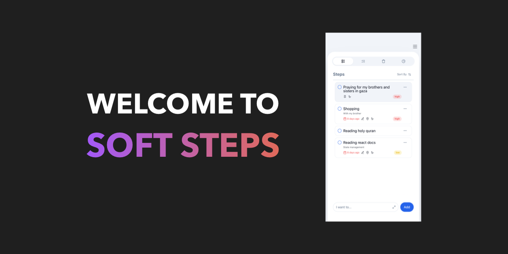
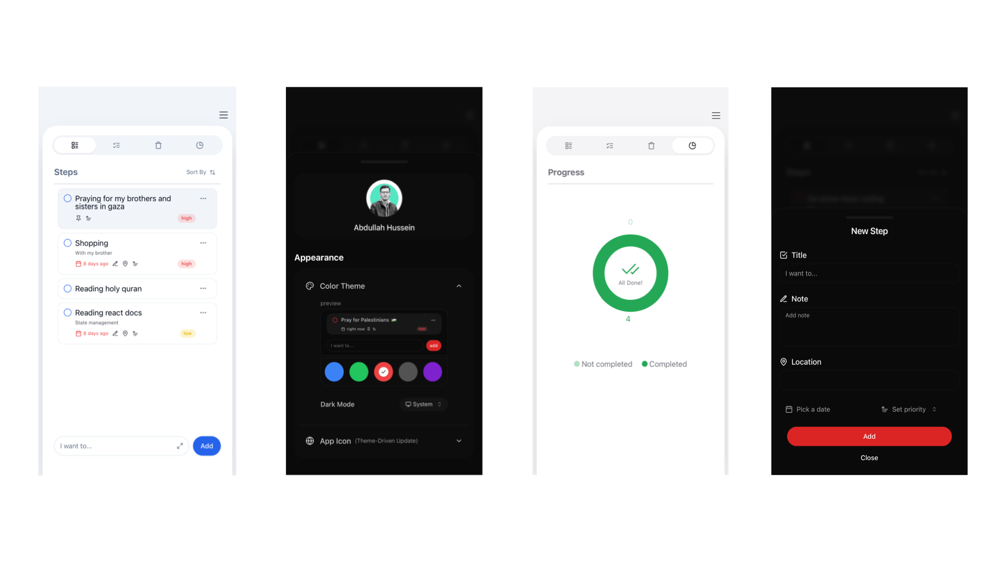

# Soft Steps - Your Tranquil Todo App

Welcome to **Soft Steps**, your serene companion in achieving productivity effortlessly. This intuitive to-do app is designed to guide you through tasks with simplicity and elegance.

## Preview



---

## Server

### Installation:

1. **Clone the repository:**

   ```bash
   git clone <repository_url>
   cd server
   ```

2. **Install dependencies:**

   ```bash
   npm install
   ```

3. **Set up environment variables:**

   - Rename the `.env.example` file to `.env`:
     ```bash
     mv .env.example .env
     ```
   - Open the `.env` file and replace the placeholders with your Supabase credentials:
     ```env
     SUPABASE_URL=https://<your_supabase_url>.supabase.co
     SUPABASE_KEY=<your_supabase_key>
     PORT=3000
     ```

4. **Start the server:**
   ```bash
   npm run start:dev
   ```
   This command compiles TypeScript, starts the server using Nodemon for development, and listens for file changes.

---

## Client

### Installation:

1. **Navigate to the client directory:**

   ```bash
   cd client
   ```

2. **Install dependencies:**

   ```bash
   npm install
   ```

3. **Set up environment variables:**

   - Rename the `.env.example` file to `.env`:
     ```bash
     mv .env.example .env
     ```
   - Open the `.env` file and replace the placeholders with your environment variables:
     ```env
      VITE_SUPABASE_URL=https://<your_supabase_url>.supabase.co
      VITE_SUPABASE_KEY=<your_supabase_key>
      VITE_API_BASE_URL=http://localhost:3000
     ```

4. **Start the client:**

   ```bash
   npm run dev
   ```

   This command launches the Vite development server.

5. **Access the app:**
   - Open your browser and go to [http://localhost:5173](http://localhost:5173).

---

## Additional Notes:

- **Important**: If you're using the local server, ensure the server is started **before** running the client. The client-side application relies on the server for API communication.
- Ensure no trailing slashes (`/`) are added to the `.env` variable values.
- The server defaults to port `3000`, but this can be adjusted in the `.env` file.
- Supabase credentials are required for authentication and database access.

---

## Contributing

Thank you for considering contributing to **Soft Steps**!

### Prerequisites:

- Activate GitHub and Google authentication in your Supabase project before contributing.

### How to Contribute:

1. Fork the repository and clone it locally.
2. Create a new branch for your feature or bug fix.
3. Implement your changes, ensuring code quality and clarity.
4. Commit your changes with meaningful commit messages.
5. Push your branch to your forked repository.
6. Submit a pull request to the `main` branch of the original repository.

---

## License

This project is licensed under the [MIT License](LICENSE).
